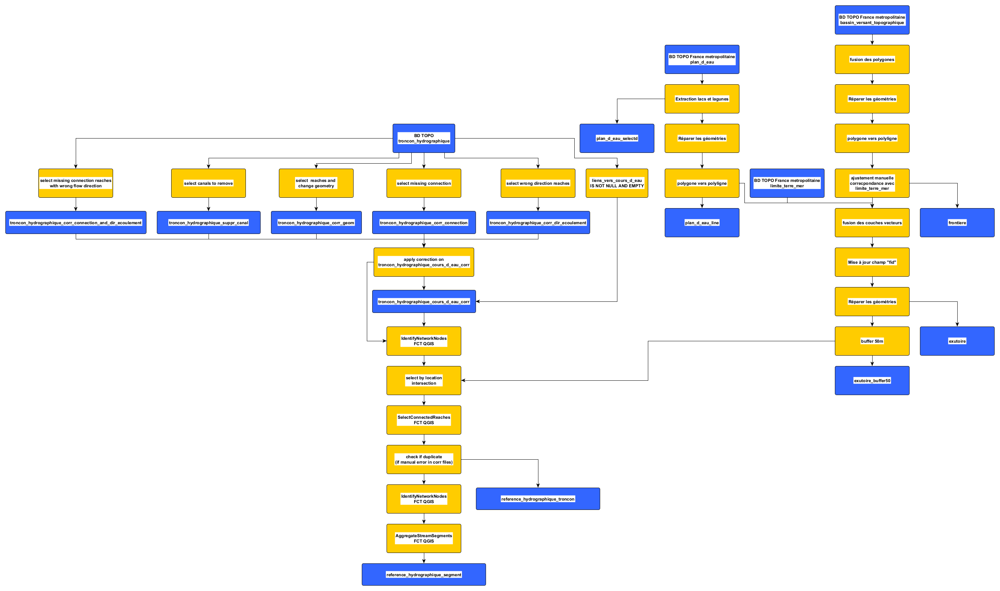

# bdtopo2refhydro

BDTOPO2REFHYDRO vise la création d'un réseau hydrographique utilisable pour l'analyse hydromorphologique sur le territoire métropolitain à partir de la BD TOPO de l'IGN.
Ce référentiel hydrographique est un réseau des cours d'eau français, coulant d'amont vers l'aval et topologiquement juste. On doit pouvoir retrouver l'ensemble des affluents d'un fleuve en remontant le sens de l'écoulement vers l'amont à partr des exutoires.

Mise en application sur la BD TOPO IGN 2021 sur la France métropolitaine.

**Dépendance**
Le plugin Fluvial Corridor Toolbox est nécessaire pour effectuer l'ensemble des opérations. Pour l'installation, se reporter au [github](https://github.com/EVS-GIS/fct-qgis).
Le plugin Append Features to Layer.

Développé et testé sur QGIS 3.28.13, la Fluvial Corridor Toolbox 1.0.11, Append Features to Layer 2.0.0.

## Création de la bande des exutoires

La bande des exutoires vise à créer une zone permettant de sélectionner l'ensemble des exutoires des fleuves français. L'objectif est de pouvoir sélectionnner l'ensemble d'un réseau hydrographique bien orienté et connecté en remontant vers l'amont.

La bande des exutoires prend en compte des données issues de la BD TOPO IGN et sont enregistrées dans creation_exutoire.gpkg : 
- La limite terre mer de la France métropolitaine pour les exutoires marins ("SELECT * FROM limite_terre_mer;" puis sélection manuelle de la France métropolitaine). => couche "limite_terre_mer".
- Des plans d'eau et lagunes. Deux plans d'eau particuliers : le lac du Bourget, le lac d'Annecy et des lagunes méditerranéennes comme celle de Thau car le réseau hydrographique de la couche cours d'eau de l'IGN ne va pas toujours au delà de la lagune et la couche limite_terre_mer ne rentre pas toujours suffisamment dans les lagunes pour atteindre le réseau hydrographique. Il y a donc une déconnexion entre les exutoires et la mer. Sélection manuelle depuis la couche plan_d_eau => plan_d_eau_selected
- Les frontières pour les réseaux des bassins qui s'écoulent en dehors de la France. Quelques traitements ont été nécessaires : 
  - Fusion des polygones bassin_versant_topographique de la BD TOPO
  - Réparer les géométries
  - Polygones vers polylignes => "bassin_versant_topographique_ligne"
  - Suppressions et ajustements manuels pour faire correspondre les frontières aux limites terre mer. => Couche "frontiere"

La création de la bande des exutoires est effectué par le script "create_exutoire.py".

## Création du référentiel hydrographique

Les tronçons hydrographiques de la BD TOPO IGN sont ajustés afin d'avoir un réseau continu des cours d'eau qui s'écoulent le l'amont vers l'aval sans rupture.
Depuis la couche troncon_hydrographique de la BD TOPO:
- Sélection des cours d'eau depuis les tronçons hydrographiques et modification des identifiants "liens_vers_cours_d_eau" et "cpx_toponyme_de_cours_d_eau" pour que ceux-ci aient uniquement le premier identifiant et nom dans le cas où plusieurs sont renseignés :
  - Voir requête SQL sous Postgresql/PostGIS pour l'extraction des données.
  - Les données sont extraites dans une base de données geopackage "troncon_hydrographique_cours_d_eau.gpkg" dans le dossier "output" avec comme nom de couche "troncon_hydrographique_cours_d_eau"
  - Dans le dossier "output" une copie de ces données dans la base de données "troncon_hydrographique_cours_d_eau_corr.gpkg" dans la couche "troncon_hydrographique_cours_d_eau_corr" sur lesquelles les corrections seront effectuées.
- Plusieurs types d'erreur sont à corriger, les entités sont enregistées dans des couches distinctes dans ./inputs/corr_reseau_hydrographique.gpkg et sont alimentées au fur manuellement pour assurer la traçabilité des modifications.
  - "troncon_hydrographique_cours_d_eau_conn" rétablie des connections du réseau ou vers les exutoires finaux. Les tronçons sont issus de troncon_hydrographique non filtrée, identifiant du cours d'eau auquels ils sont rattachés est ajouté au champ liens_vers_cours_d_eau.
  - "troncon_hydrographique_cours_d_eau_modif_geom" sont des modifications de la géométrie de tronçons pour permettre la liaison aux exutoires finaux ou la connection lorsque des tronçons n'exsite pas dans la couche troncon_hydrographique non filtrée.
  - "troncon_hydrographique_cours_d_eau_corr_dir_ecoulement" contient les tronçons dont le sens d'écoulement doit être inversé pour permettre une continuité amont-aval.
  - "troncon_hydrographique_conn_corr_dir_ecoulement" mélange deux types de correction. Les tronçons de la couche doivent être ajouté pour assurer des connections puis leur sens d'écoulement inversé pour assurer l'écoulement vers l'aval.
  - "troncon_hydrographique_corr_suppr_canal_multichenal" contient les canaux et les chenaux secondaires à supprimer. Les canaux sont supprimés pour avoir un réseau des cours d'eau uniquement (les cours d'eau chenalisés sont néanmoins conservés). Les chenaux secondaire sont supprimés, ou du moins dans leur partie au niveau de la diffluence de façon à avoir un chenal unique par fond de vallée.
- Depuis la bande des exutoires, les exutoires des tronçons hydrographiques corrigés sont sélectionnés puis le réseau hydrographique connecté à ces exutoires sont sélectionnées en remontant l'écoulement (la direction des segments du réseau). Les multichenaux sont retirés, le chenal choisi est le plus court chemin de l'exutoire à la source. Une sortie par tronçon est exporté "reference_hydrographique_troncon" avec ces tronçons sélectionnés. Une autre sortie est générée avec les tronçons aggrégés à chaque intersection du réseau.



## Mise application QGIS

Import des données IGN SQL dans une base de données PostgreSQL/PostGIS

Extraction de la couche tronçon hydrographique depuis cette base de données en ne retenant que les cours d'eau et avec liens_vers_cours_d_eau et cpx_toponyme_de_cours_d_eau ne renseignant que le premier identifiant ou  nom si plusieurs identifiants ou noms sont renseignés : 
``` sql
SELECT 
cleabs,
code_hydrographique,
code_du_pays,
nature,
fictif,
position_par_rapport_au_sol,
etat_de_l_objet,
date_creation,
date_modification,
date_d_apparition,
date_de_confirmation,
sources,
identifiants_sources,
precision_planimetrique,
precision_altimetrique,
mode_d_obtention_des_coordonnees,
mode_d_obtention_de_l_altitude,
statut,
persistance,
fosse,
navigabilite,
salinite,
numero_d_ordre,
strategie_de_classement,
origine,
perimetre_d_utilisation_ou_origine,
sens_de_l_ecoulement,
reseau_principal_coulant,
delimitation,
classe_de_largeur,
type_de_bras,
commentaire_sur_l_objet_hydro,
code_du_cours_d_eau_bdcarthage,
CASE 
    WHEN POSITION('/' IN liens_vers_cours_d_eau) > 0
    THEN SUBSTRING(liens_vers_cours_d_eau FROM 1 FOR POSITION('/' IN liens_vers_cours_d_eau) - 1)
    ELSE liens_vers_cours_d_eau
  END AS liens_vers_cours_d_eau, -- keep only first id if several
liens_vers_surface_hydrographique,
lien_vers_entite_de_transition,
CASE 
    WHEN POSITION('/' IN cpx_toponyme_de_cours_d_eau) > 0
    THEN SUBSTRING(cpx_toponyme_de_cours_d_eau FROM 1 FOR POSITION('/' IN cpx_toponyme_de_cours_d_eau) - 1)
    ELSE cpx_toponyme_de_cours_d_eau
  END AS cpx_toponyme_de_cours_d_eau, -- keep only first name if several
cpx_toponyme_d_entite_de_transition,
geom
FROM troncon_hydrographique
WHERE (liens_vers_cours_d_eau IS NOT NULL AND liens_vers_cours_d_eau != '')
```

Enregistrement dans le geopackage ./outputs/troncon_hydrographique_cours_d_eau_corr.gpkg|troncon_hydrographique_cours_d_eau_corr

Le programme create_reference_hydro_workflow.py permet de lancer les différents scripts de corrections sur troncon_hydrographique_cours_d_eau_corr, créer la couche d'éxutoire et extraire de l'ensemble du réseau hydrographique en remontant depuis ces exutoires et enregister le référentiel hydrographique dans reference_hydrographique.gpkg. Ce programme se lance directement depuis la console Python de QGIS.

Les chemins des dossiers sont à définir par l'utilisateur en fin du script dans l'exécution de la fonction. Par défaut les chemins des dossier sont les suivants :
- workdir = **Dossier de travail personnel, à changer impérativement**
- script_folder = pyqgis_scripts/ (contenu dans workdir)
- inputs_folder = inputs/ (contenu dans workdir)
- outputs = /outputs (contenu dans workdir)
Les fichiers gpkg doivent tous être dans les dossiers défini par les inputs et outputs files.

## Création du référentiel hydrographique des cours d'eau de plus de 5m de large de la France métropolitaine sur les surfaces hydrographiques

Dans la définition de la BD TOPO, les surfaces en eaux des cours d'eau de plus de 5m de large sont enregistrées dans la couche surface_hydrographique. On y trouve donc les surfaces en eau des écoulements naturels du réseau hydrographique mais également les retenues des barrages, situées sur l'écoulement naturel. L'objectif est t'utiliser les surfaces hydrographiques pour obtenir un réseau hydrographique des cours d'eau de plus 5m de large. La mise en application peut s'effectuer à différentes échelle, ici par région hydrographique. Ce réseau est donc effectué sur la référence hydrographique produite à partir de la BD TOPO des autres outils, au choix sur les tronçons ou les segments (plus rapide sur les segments).

La couche surface_hydrographique doit donc être chargé dans une base de données PostgreSQL/PostGIS.

Extraction des données d'écoulement naturel et des lacs de retenue des barrages.
``` sql
SELECT * FROM surface_hydrographique WHERE nature LIKE 'Ecoulement_naturel' OR nature LIKE 'Retenue-barrage'
```

La création de ce réseau à partir des surface hydrographique d'effectue à partir d'une zone ou bassin versant défini. Le réseau de référence complet ainsi de les surfaces hydrographiques seront découpés par cette zone avant la construction de la référence hydrographique de plus de 5m de large.

La référence hydrographique de plus de 5m de large est effectée par create_5m_width_hydro_network.py. Le script est a lancer dans la console Python de QGIS 3.

Les chemins des inputs et outputs sont à définir par l'utilisateur en fin du script dans l'exécution de la fonction. Par défaut les chemins des dossier sont les suivants :
- wd = **Dossier de travail personnel, à changer impérativement**
- outputs = outputs/ (contenu dans wd)
Les fichiers gpkg doivent tous être dans le dossier défini par outputs.

